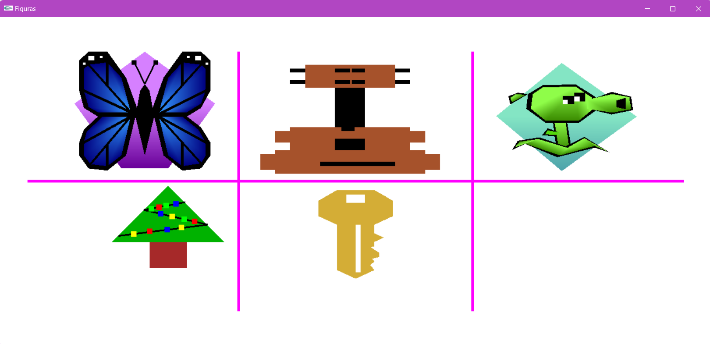

# Practica-Figuras
Esta práctica se centra en el uso de OpenGL dentro del entorno CoreBlocks para la creación y representación gráfica de diversas figuras propuestas por los integrantes del equipo. 

El proyecto tiene como propósito aplicar conceptos fundamentales de gráficos por computadora mediante la construcción de formas complejas a partir de primitivas geométricas básicas. Entre las figuras realizadas se incluyen una mariposa, una guitarra, una planta, un pino y una llave. 

A través de esta actividad, los estudiantes desarrollan habilidades en la manipulación de coordenadas, el uso de colores, y la comprensión del pipeline gráfico, fomentando la creatividad y la capacidad de abstracción para diseñar objetos mediante código.

## Tecnologías

* C++
* OpenGL
* CoreBlocks

  ---
  Desarrollado con 💖 por [Anadalay](https://www.linkedin.com/in/anadalay-laureani/)

